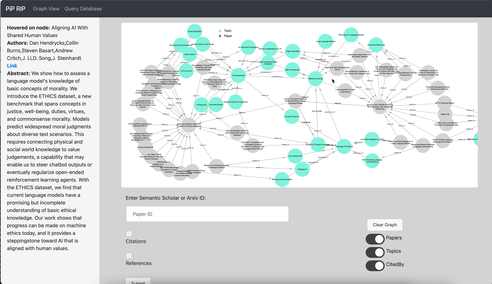

# PiP RIP 
### _Papers into Perspectives – Research Intelligence Processor_



### Introduction
Have you ever found yourself embarking on a research project, only to feel overwhelmed the moment you start exploring the topic? It's a common hurdle for researchers and students alike—entering a keyword and being inundated with hundreds of papers, each seemingly more complex than the last.

With so much data at our fingertips, how can we discern what's truly important and relevant, and quickly make sense of our research? Learning often happens when one begins making connections between concepts and topics. If only there was a way to obtain a bird eye's view of the available literature and visualize the connections between papers in an intuitive manner!

This is what we strive to accomplish in our hackathon project, titled **Papers into Perspectives – Research Intelligence Processor**. PiPRIP is a Gemini-powered knowledge graph generator that picks up key topics from the provided research papers and builds connections between those topics. By combining Gemini's LLM capabilities with the unique features of a graph data structure, our tool automates the process of knowledge visualization.

PiPRIP's generated knowledge graph enables users to:
- Identify relationships between papers at a glance
- Conveniently discover papers with overlapping topics
- Trace the citations/references lineage of papers, to understand how the research evolves over time

### Main features
**Populating the graph:** First, obtain the ArXiv or Semantic Scholar ID of a paper you are interested in. Entering the paper ID into the input form kickstarts the graph building process. Be patient as this can take a while depending on whether references/citations are requested. Once completed, the graph will be displayed on the canvas, comprising nodes (papers and generated topics) and labelled edges representing directional relationships between the papers/topics.

**Fetching paper citations/references:** Checking the respective checkboxes before submitting the form will fetch the paper's citations/references together with the paper, if available. These will show up as additional paper nodes on the graph. Citations/references will be connected to the cited/referenced paper via a _cited_by_ edge.

**Viewing paper metadata:** Hovering over a paper node displays the paper's metadata in the left sidebar (title, authors, abstract, link to paper).

**Viewing topic descriptions:** Hovering over a topic node displays the topic's description, generated by Gemini.

**Graph filters:** Toggles are available on the bottom right control panel for hiding papers/topics and _cited_by_ edges.

---
### Tech overview
APIs for fetching paper metadata:
- Semantic Scholar
- ArXiv API
  
Knowledge graph generation:
- Google Gemini API

Web app:
- D3.js
- Memgraph database
- Flask, Docker

---
### Setup and testing instructions
A Gemini API key is required for generating the knowledge graph.
- Create a file called `api_key.yaml` in the `backend/gemini/config/` folder.
- Add in `GEMINI_API_KEY: <your api key>`.

You will require Docker desktop to build and run the Docker container for starting up the web UI.
```
docker-compose build
docker-compose up
```
Once the container has launched, open an incognito browser window and browse the UI at localhost:5000.

Notes when testing:
- If you try to retrieve too many papers within a short time, you will be rate-limited by the Semantic Scholar API. In this scenario, the algorithm will fallback to the ArXiv API, which only fetches the paper itself without any references/citations (to fallback to the ArXiv API, you must submit an ArXiv ID instead of a Semantic Scholar ID).

---
_PiPRIP is built by @chelchia, @g-lilian and @sadakosa._

_Credit goes to https://github.com/memgraph/sng-demo for their demo of how to set up a social network graph visualization using D3 and Memgraph._
